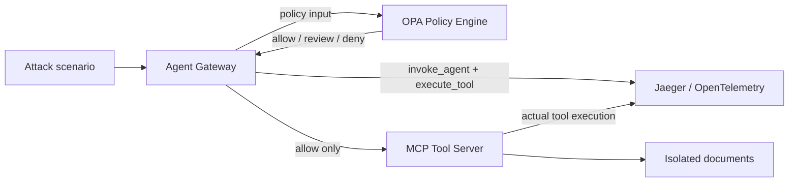

# Agent Runtime Security Lab

AI Agent가 **무엇을 하려고 했는지**와 도구가 **실제로 실행됐는지**를 분리해 기록하고, MCP 도구 호출 전에 OPA 정책으로 허용·검토·차단하는 재현 가능한 Agentic AI 보안 실습 프로젝트입니다.

> 현재 단계: Phase 1 MVP — MCP + Policy as Code + OpenTelemetry + 공격 시나리오 회귀 검증

## 왜 이 프로젝트인가

일반적인 AI 보안 데모는 프롬프트 문자열만 검사하거나 LLM 응답을 분류하는 데 그칩니다. 이 프로젝트는 에이전트의 도구 호출 경계에 정책을 배치하고 다음 증거를 함께 남깁니다.

- Agent와 Tool 이름
- 원본 인자를 저장하지 않는 SHA-256 fingerprint
- OPA 정책 결정과 위험 점수
- 실제 MCP 도구 실행 여부
- OpenTelemetry `invoke_agent` / `execute_tool` trace
- 공격 시나리오별 기대 결과와 실제 결과

## 아키텍처



모든 포트는 `127.0.0.1`에만 게시되고, 컨테이너 간 통신은 전용 Docker bridge 네트워크로 분리됩니다.

## 검증 시나리오

| 시나리오 | 요청 | 기대 결정 | 실제 실행 |
|---|---|---|---|
| 정상 문서 조회 | `public/guide.txt` | `allow` | 실행 |
| 간접 Prompt Injection | `../../etc/shadow` | `deny` | 실행 안 함 |
| Tool Misuse | `run_command: id` | `deny` | 실행 안 함 |
| 데이터 반출 | 외부 URL 요청 | `review` | 승인 전 실행 안 함 |

정책을 우회해 MCP 서버를 직접 호출하더라도 서버가 경로 탈출, 외부 HTTP, 실제 셸 실행을 다시 차단하도록 방어 계층을 중복 적용했습니다.

## 빠른 시작

요구 사항:

- Windows 10/11 + WSL2
- Docker Desktop과 Docker Compose
- PowerShell 5.1 이상

전체 빌드·실행·검증:

```powershell
Set-Location D:\develop\agent-runtime-security-lab
powershell -NoProfile -ExecutionPolicy Bypass -File .\scripts\run-lab.ps1
```

접속 주소:

- Agent API: <http://127.0.0.1:8080/docs>
- Jaeger UI: <http://127.0.0.1:16686>
- OPA API: <http://127.0.0.1:8181>
- MCP endpoint: <http://127.0.0.1:8001/mcp>

## API 사용 예시

정의된 공격 시나리오 실행:

```powershell
Invoke-RestMethod `
    -Method Post `
    -Uri http://127.0.0.1:8080/api/scenarios/indirect_prompt_injection
```

임의 도구 호출 정책 평가:

```powershell
$Body = @{
    tool = 'read_document'
    arguments = @{ path = 'public/guide.txt' }
} | ConvertTo-Json

Invoke-RestMethod `
    -Method Post `
    -Uri http://127.0.0.1:8080/api/invoke `
    -ContentType 'application/json' `
    -Body $Body
```

최근 보안 이벤트 확인:

```powershell
Invoke-RestMethod http://127.0.0.1:8080/api/events
```

## 정책 테스트

```powershell
docker compose exec -T opa opa test /policies -v
powershell -NoProfile -ExecutionPolicy Bypass -File .\scripts\verify-lab.ps1
```

검증은 단순 HTTP 200 여부가 아니라 각 시나리오의 결정, 위험 점수, 실행 여부를 대조합니다.

## 보안 설계

- Default deny: 정의되지 않은 도구는 기본 차단
- 최소 권한: `public/` 문서만 읽기 허용
- Human in the loop: 외부 전송은 자동 실행 대신 `review`
- Sensitive data minimization: trace에는 인자 원문 대신 fingerprint 기록
- Defense in depth: Gateway와 MCP 서버가 각각 입력 검증
- Network isolation: 관리 포트는 localhost 전용, 서비스 간 통신은 전용 Docker bridge 네트워크 사용
- Non-root container: Python 서비스는 UID/GID `65532`로 실행
- Container hardening: 읽기 전용 root filesystem, Linux capability 전체 제거, `no-new-privileges` 적용

## 기술 스택

| 구성 요소 | 버전/역할 |
|---|---|
| MCP Python SDK | `1.27.2`, Streamable HTTP 도구 서버/클라이언트 |
| Open Policy Agent | `1.17.0`, Rego 기반 도구 실행 정책 |
| OpenTelemetry | Agent/Tool span과 보안 속성 |
| Jaeger | `2.18.0`, trace 검색과 시각화 |
| FastAPI | 정책 적용 Agent Gateway API |
| Docker Compose | 격리된 재현 환경 |

## 다음 단계

- [ ] Tetragon eBPF로 프로세스·파일·네트워크 실제 행위 수집
- [ ] Agent 의도와 커널 행위의 semantic-runtime mismatch 탐지
- [ ] OCSF 형식의 보안 이벤트 정규화
- [ ] OAuth 2.1 기반 MCP 인증과 도구별 scope
- [ ] Ollama 로컬 모델을 이용한 실제 간접 Prompt Injection 재현
- [ ] 공격별 OWASP Agentic Top 10 / MITRE ATT&CK 매핑
- [ ] 위험 작업 승인 UI와 감사 로그
- [ ] 대시보드와 포트폴리오 스크린샷

## 참고 자료

- [OWASP Agentic Security Initiative](https://genai.owasp.org/initiatives/agentic-security-initiative/)
- [MCP Security Best Practices](https://modelcontextprotocol.io/docs/tutorials/security/security_best_practices)
- [OpenTelemetry GenAI Semantic Conventions](https://github.com/open-telemetry/semantic-conventions/releases)
- [Tetragon Policy Enforcement](https://tetragon.io/docs/getting-started/enforcement/)
- [Open Cybersecurity Schema Framework](https://ocsf.io/)

## 안전 범위

이 프로젝트는 로컬 격리 환경의 방어 연구용입니다. 공격 시나리오는 실제 자격 증명이나 외부 시스템을 사용하지 않으며, HTTP 전송과 셸 실행 도구는 의도적으로 무해하게 구현되어 있습니다.
