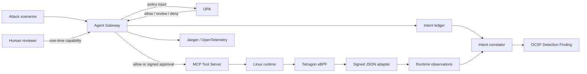

# Agent Runtime Security Lab

AI Agent가 **허가받은 행동(intent)** 과 컨테이너에서 **실제로 관측된 행동(runtime observation)** 을 비교해 정책 우회와 도구 오용을 탐지하는 로컬 보안 실습 프로젝트입니다.

> Current: **Phase 4 — Live Tetragon eBPF Evidence + Automatic Correlation**


- [Phase 2: Runtime Approval Control Plane](docs/PHASE2.md)
- [Phase 3: Intent / Runtime Correlation](docs/PHASE3.md)
- [Phase 4: Live Tetragon eBPF Validation](docs/PHASE4.md)

## Why this project

일반적인 AI 보안 데모는 프롬프트 문자열 또는 모델 응답만 검사합니다. 이 프로젝트는 판단 지점을 MCP 도구 실행 경계와 Linux 런타임까지 확장합니다.

- OPA가 도구 요청을 `allow / review / deny`로 분류
- 위험 작업은 사람의 승인과 1회성 HMAC capability 요구
- 실행 전 agent intent를 별도 원장에 기록
- Tetragon 이벤트를 프로세스·파일·네트워크 observation으로 정규화
- Docker container ID와 event timestamp로 intent를 자동 상관분석
- intent와 observation이 다르면 Critical/High finding 생성
- 원본 인자와 관측 대상을 OCSF 내보내기에서 fingerprint로 비식별화
- Jaeger에서 `invoke_agent`와 `execute_tool` span 추적

## Architecture



기본 Compose와 GitHub Actions는 결정론적 시뮬레이터로 회귀 검증합니다. 별도 Phase 4 검증은 Windows Docker Desktop의 WSL2 Linux 커널에 Tetragon v1.7.0 eBPF 프로그램을 실제로 attach해 커널 이벤트를 수집합니다.

## Detection scenarios

| Layer | Scenario | Policy intent | Runtime observation | Result |
|---|---|---|---|---|
| Policy | Public document read | `allow` | MCP execution | Allowed |
| Policy | `../../etc/shadow` path traversal | `deny` | None | Blocked |
| Policy | Shell tool misuse | `deny` | None | Blocked |
| Approval | External transfer request | `review` | None until approval | Pending |
| Runtime | Public document file access | `allow + file_access` | Expected path | Match |
| Runtime | Process execution after deny | No runtime activity | `process_exec` | Critical mismatch |
| Runtime | Network connection before approval | No runtime activity | `network_connect` | Critical mismatch |
| Runtime | Observation without intent | No matching intent | Any event | High orphan finding |

## Quick start

Requirements:

- Windows 10/11 + WSL2 or Linux
- Docker Desktop / Docker Engine with Compose
- PowerShell 5.1+

```powershell
Set-Location D:\develop\agent-runtime-security-lab
powershell -NoProfile -ExecutionPolicy Bypass -File .\scripts\run-lab.ps1
```

Services:

- Security dashboard: <http://127.0.0.1:8080>
- OpenAPI: <http://127.0.0.1:8080/docs>
- Runtime OCSF: <http://127.0.0.1:8080/api/runtime/ocsf>
- Jaeger: <http://127.0.0.1:16686>
- OPA: <http://127.0.0.1:8181>

MCP는 호스트 포트를 공개하지 않으며 전용 Docker bridge 안에서만 접근됩니다.

## Try Phase 3

정상 file observation과 intent를 비교합니다.

```powershell
Invoke-RestMethod `
    -Method Post `
    -Uri http://127.0.0.1:8080/api/runtime/scenarios/matched_file_read
```

정책이 거부한 뒤 프로세스가 실행된 우회 상황을 재현합니다.

```powershell
Invoke-RestMethod `
    -Method Post `
    -Uri http://127.0.0.1:8080/api/runtime/scenarios/denied_process_bypass
```

```powershell
Invoke-RestMethod http://127.0.0.1:8080/api/runtime/intents
Invoke-RestMethod http://127.0.0.1:8080/api/runtime/observations
Invoke-RestMethod http://127.0.0.1:8080/api/runtime/findings
Invoke-RestMethod http://127.0.0.1:8080/api/runtime/ocsf
```

## Try Phase 4 — live eBPF

기본 Lab을 실행한 뒤 관리자 권한이 아닌 일반 PowerShell에서 실센서 검증을 실행합니다.

```powershell
powershell -NoProfile -ExecutionPolicy Bypass -File .\scripts\verify-tetragon.ps1
```

스크립트가 수행하는 작업:

1. 공식 `quay.io/cilium/tetragon:v1.7.0` 이미지를 privileged sensor로 실행
2. 커널 BTF와 eBPF base sensor attach 확인
3. monitor-only TracingPolicy 적용
4. 실제 `security_file_permission` event를 정상 intent와 자동 연결
5. 정책 거부 직후 발생시킨 실제 `process_exec`를 Critical mismatch로 탐지

Tetragon만 커널 관측을 위해 privileged로 실행됩니다. Agent Gateway와 MCP 컨테이너는 계속 non-root, read-only, `cap_drop: ALL` 상태입니다. 검증 후 센서를 중지하려면 `-StopSensor`를 사용합니다.

## Tetragon adapter

Linux/Kubernetes에서 [`deploy/tetragon/runtime-observation.yaml`](deploy/tetragon/runtime-observation.yaml)을 적용하고 Tetragon JSONL을 adapter에 전달합니다.

```bash
kubectl apply -f deploy/tetragon/runtime-observation.yaml

export RUNTIME_SENSOR_HMAC_KEY='<same key as agent-api>'
tetra getevents -o json | python sensor/tetragon_adapter.py \
  --container-alias '<docker-id>=arsl-mcp-server' \
  --container-name arsl-mcp-server \
  --gateway http://127.0.0.1:8080
```

`--intent-id`는 선택 사항입니다. 생략하면 Gateway가 container identity와 15초 event window로 자동 correlation합니다. 자세한 실센서 증거와 한계는 [Phase 4 문서](docs/PHASE4.md)를 참고하세요.

## Security controls

- **Default deny**: 정의되지 않은 도구와 권한은 기본 차단
- **Human in the loop**: 외부 전송은 자동 실행 대신 승인 대기
- **One-time capability**: 도구·인자 fingerprint·approval ID·만료 시각을 HMAC으로 바인딩하고 재사용 차단
- **Sensor authenticity**: observation 본문 전체를 별도 HMAC 키로 검증
- **Runtime correlation**: 허가되지 않은 process/network/file 행동 탐지
- **Privacy by design**: OCSF에는 원본 인자와 target 대신 SHA-256 fingerprint 기록
- **Network isolation**: 관리 포트는 loopback 전용, MCP는 내부 네트워크 전용
- **Container hardening**: non-root, read-only root filesystem, all capabilities dropped, `no-new-privileges`
- **Fail closed**: OPA 장애 또는 잘못된 sensor signature는 요청 거부

## Validation

```powershell
docker compose config --quiet
powershell -NoProfile -ExecutionPolicy Bypass -File .\scripts\verify-lab.ps1
powershell -NoProfile -ExecutionPolicy Bypass -File .\scripts\verify-tetragon.ps1
```

기본 검증은 OPA 5개 정책 테스트, Agent API 14개와 adapter 5개 단위 테스트, 4개 정책 시나리오, approve/deny 및 replay 방어, 3개 runtime correlation 시나리오, 서명된 센서 수집, OCSF 1.8 비식별화를 확인합니다. 별도 Phase 4 검증은 실제 커널 event 2종을 확인합니다. GitHub Actions에서는 권한 제한 때문에 결정론적 기본 검증만 실행합니다.

## Tech stack

| Component | Role |
|---|---|
| FastAPI | Agent gateway, intent ledger, correlation API |
| MCP Python SDK | 격리된 tool server |
| Open Policy Agent 1.17 | Rego 기반 tool policy |
| Tetragon 1.7.0 | 실제 eBPF process/file/network runtime telemetry |
| OCSF 1.8 | API Activity, AI Operation, Detection Finding |
| OpenTelemetry + Jaeger 2.18 | Agent/tool distributed tracing |
| Docker Compose | 격리·재현 가능한 로컬 환경 |

## Roadmap

- [x] OPA 기반 allow/review/deny policy
- [x] Human approval + one-time capability
- [x] OCSF 1.8 AI Operation evidence
- [x] Intent / runtime mismatch detection
- [x] Signed Tetragon JSON adapter
- [x] Docker Desktop WSL2 실센서 end-to-end 캡처 자동화
- [ ] Kind/Kubernetes Runtime Hook과 pod identity correlation
- [ ] OAuth 2.1 기반 MCP 인증 및 tool scope
- [ ] Local LLM indirect prompt injection 재현
- [ ] OWASP Agentic Top 10 / MITRE ATT&CK 자동 매핑
- [ ] Elasticsearch/Kibana 장기 보관과 hunt dashboard

## References

- [Tetragon installation and requirements](https://tetragon.io/docs/installation/)
- [Tetragon TracingPolicy](https://tetragon.io/docs/concepts/tracing-policy/)
- [OCSF schema](https://github.com/ocsf/ocsf-schema)
- [MCP Security Best Practices](https://modelcontextprotocol.io/docs/tutorials/security/security_best_practices)
- [OWASP Agentic Security Initiative](https://genai.owasp.org/initiatives/agentic-security-initiative/)

## Safety scope

이 저장소는 격리된 로컬 교육 환경용입니다. 공격 시나리오는 실제 외부 전송이나 셸 실행 없이 모의 처리합니다. Tetragon 정책은 관측 전용이며 운영 시스템에 적용하기 전에 대상 커널과 이벤트 부하를 별도로 검증해야 합니다.
