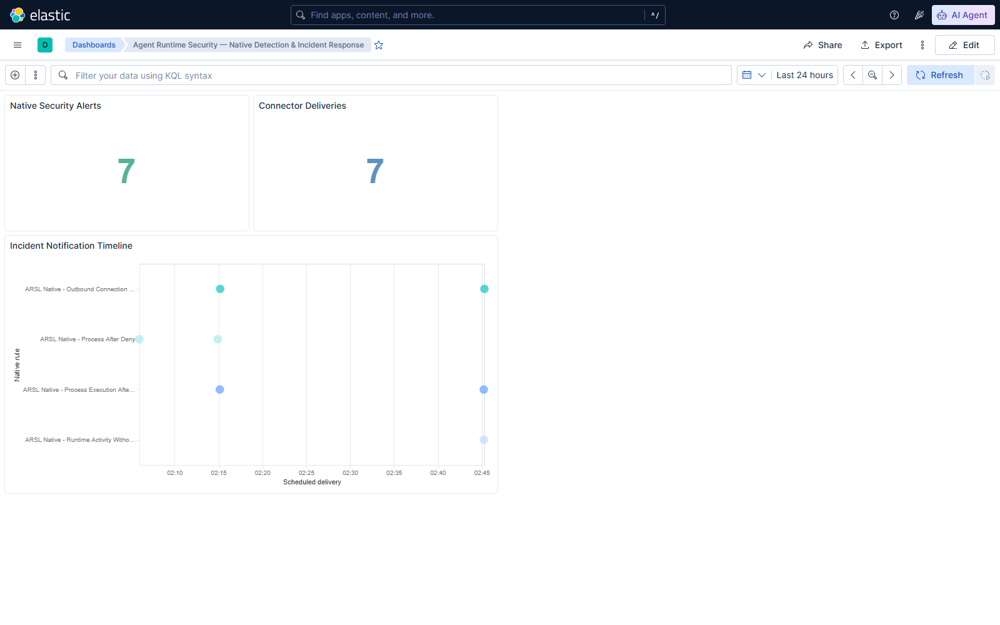
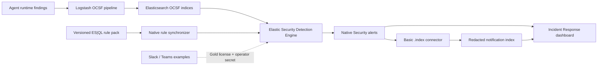

# Phase 11 — Elastic-Native Detection & Incident Response

## Executive summary

Phase 11 promotes the versioned ES|QL detection pack from a custom replay runner into Elastic Security's native Detection Engine. Three rules execute every minute, create native alerts, and deliver a deliberately minimal incident record through a Basic-license index connector. A reproducible replay proves delivery and verifies that subsequent schedules do not create duplicates for the same source events.



## Why this phase matters

A detection query is only one part of an operational SOC control. Production-shaped detection also needs scheduling, execution health, durable alerts, controlled delivery, duplicate handling, and an analyst view. This phase exercises that complete path without requiring a paid Elastic license or external webhook credentials.

## Architecture



## Implemented controls

### Native scheduled detections

`detection/native_alerting.py` converts the existing three-rule pack to Elastic Security ES|QL rules and upserts them by stable `rule_id`. Every rule is enabled, runs at a one-minute interval, looks back two minutes, and uses the Detection Engine's native alert lifecycle.

| Native rule | Attack class | Severity |
|---|---|---|
| `arsl-native-denied-process-execution` | process execution after policy deny | critical |
| `arsl-native-network-before-approval` | outbound connection before approval | critical |
| `arsl-native-orphan-runtime-activity` | runtime activity without agent intent | high |

### License-aware delivery

The lab queries Kibana's connector-type API before synchronization. Elastic 9.4.2 Basic enables the `.index` connector, so the default path writes to `arsl-notifications-v1`. Slack and Teams are represented by configuration templates only: the running Basic lab reports that both require Gold, and no external secret is committed or synthesized.

The connector exports only:

- alert ID;
- rule ID and rule name;
- delivery channel and status;
- delivery timestamp.

Raw tool arguments, runtime targets, prompt content, and connector secrets are excluded.

### Retention and analyst view

`arsl-notifications-*` uses a strict mapping and a seven-day ILM policy. The importable Kibana dashboard shows native alert volume, connector delivery volume, and a rule-by-time incident timeline.

## Reproduce

```powershell
docker compose --profile soc up -d --build
powershell -NoProfile -ExecutionPolicy Bypass -File .\scripts\run-native-alerting.ps1
```

The script installs the index template, synchronizes the connector and rules, imports the dashboard, creates three fresh findings, waits for native schedules, and holds through another schedule to verify stable counts.

## Actual validation result

The committed evidence records a successful Elastic 9.4.2 Basic run:

| Check | Result |
|---|---:|
| enabled native ES|QL rules | 3 |
| native alerts created | 3 |
| connector notifications created | 3 |
| alerts after replay window | 3 |
| notifications after replay window | 3 |
| rule execution status | succeeded |
| raw sensitive values exported | false |

Machine-readable results are in [Phase 11 evidence](evidence/phase11-native-alerting.json).

## Operational trade-offs

- The Basic path is fully executable and local, but it is an index-backed notification queue rather than an external chat delivery.
- Slack and Teams require an eligible Elastic license and operator-managed webhook secrets; the examples are intentionally inert.
- The replay validates stable alert counts over one additional schedule. Long-running retention and alert closure remain SOC operating procedures, not part of this bounded lab.

## References

- [Elastic ES|QL rules](https://www.elastic.co/docs/solutions/security/detect-and-alert/esql)
- [Elastic alert suppression](https://www.elastic.co/docs/solutions/security/detect-and-alert/alert-suppression)
- [Elastic detection rule concepts](https://www.elastic.co/docs/solutions/security/detect-and-alert/detection-rule-concepts)
- [Kibana connectors](https://www.elastic.co/docs/reference/kibana/connectors-kibana)
