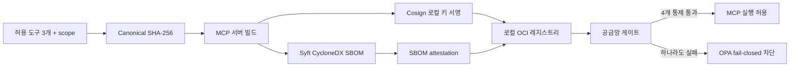

# Phase 12 — MCP 공급망 신뢰 게이트

## 목표

Phase 12는 MCP 서버가 실행되기 전에 소프트웨어 공급망 신뢰를 검증합니다. 이미지 서명 하나만 확인하지 않고, immutable digest·CycloneDX SBOM attestation·최소 권한 도구 매니페스트까지 동일 아티팩트에 결합합니다.

## 설계



게이트가 검사하는 항목은 다음과 같습니다.

1. Cosign 공개키로 이미지 서명이 검증되는가
2. 이미지 참조가 tag가 아닌 `@sha256:` digest로 고정됐는가
3. 동일 digest에 CycloneDX SBOM attestation이 존재하는가
4. 이미지 OCI label의 도구 매니페스트 hash가 저장소의 canonical manifest와 일치하는가

## 위협 모델과 차별점

일반적인 SBOM 데모는 목록 생성에서 끝나고, 이미지 서명 데모는 서명된 악성 업데이트를 구분하지 못할 수 있습니다. 이 구현은 `read_document`, `mock_http_request`, `run_command` 세 도구와 각 `mcp:<tool>` OAuth scope를 canonical manifest로 만들고 이미지에 결합합니다. 따라서 공격자가 정상 키로 변조 이미지를 서명하더라도 도구 권한 drift가 있으면 실행 전에 차단됩니다.

| 공격 재현 | 1차 방어 | 최종 결정 | 컨테이너 실행 |
|---|---|---|---|
| unsigned image 교체 | Cosign 서명 검증 | deny | 안 함 |
| mutable tag 참조 | digest pin 요구 | deny | 안 함 |
| 서명된 도구 매니페스트 변조 | OCI label과 canonical hash 비교 | deny | 안 함 |

## 실행

```powershell
Set-Location D:\develop\agent-runtime-security-lab
powershell -NoProfile -ExecutionPolicy Bypass -File .\scripts\run-supply-chain.ps1
```

스크립트는 Cosign v3.1.2와 Syft v1.49.0 release checksum을 먼저 확인합니다. 도구·임시 키·원본 SBOM은 Git에서 제외된 `runtime/phase12`에만 생성됩니다. 테스트 레지스트리는 `supply-chain` Compose profile로 분리되어 있습니다.

## 검증 결과

- 전체 실행: `passed`
- 신뢰 이미지 통제: 4/4 통과
- 공격 재현: 3/3 차단
- SBOM component: 650개
- OPA 정책 테스트: 9/9 통과
- Python 공급망 게이트 테스트: 7/7 통과
- 악성 테스트 컨테이너 실행: 0회

기계 판독형 결과는 [`phase12-mcp-supply-chain.json`](evidence/phase12-mcp-supply-chain.json)에 있습니다. 비밀키, 서명 비밀번호, 원시 서명, SBOM 패키지 경로는 결과에서 제외했습니다.

## SOC 연동

- Elasticsearch strict mapping: [`arsl-supply-chain-template.json`](../deploy/elasticsearch/arsl-supply-chain-template.json)
- Kibana import asset: [`arsl-supply-chain-dashboard.ndjson`](../deploy/kibana/arsl-supply-chain-dashboard.ndjson)
- 대시보드 ID: `arsl-phase12-supply-chain`
- 보존 정책: 기존 `arsl-ocsf-7d` ILM 재사용

## 운영 환경으로 확장할 때

로컬 재현은 외부 로그로 아티팩트 정보를 보내지 않기 위해 ephemeral key와 offline signing config를 사용합니다. 실제 CI/CD에서는 GitHub Actions OIDC 기반 keyless signing, transparency log, 조직 정책 기반 certificate identity 검증, 원격 registry admission controller로 교체해야 합니다. `--allow-insecure-registry`와 `--insecure-ignore-tlog`는 이 로컬 실험 경로에서만 활성화됩니다.
