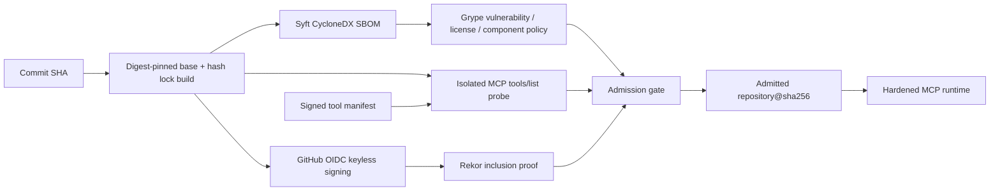

# Phase 13 — Keyless MCP Admission

## 목표

Phase 13의 목표는 공급망 검증 결과를 문서나 label에 남기는 데 그치지 않고, **검증된 digest만 실제 MCP 프로세스로 실행되도록 강제**하는 것입니다. 공격자가 정상 manifest hash label을 복사하고 이미지를 다시 서명하더라도, 격리된 pre-admission 환경에서 실제 `tools/list`가 서명된 manifest와 다르면 실행되지 않습니다.

## 최종 흐름



## Threat → Control → Evidence

| 위협 | 통제 | 증거 |
|---|---|---|
| 정상 hash label을 재사용한 변조 이미지 | signed tool-manifest attestation과 실제 `tools/list` 입력 스키마 비교 | `signed_tool_manifest_verified`, `actual_mcp_inventory_matched` |
| 다른 저장소·workflow·branch가 발급한 인증서 | GitHub OIDC의 정확한 `repository/workflow/ref` identity와 issuer 검증 | Keyless Supply Chain workflow |
| transparency log를 우회한 서명 | `--insecure-ignore-tlog` 없이 Rekor inclusion 검증 | `rekor_inclusion_verified` |
| tag 교체 또는 gate 우회 실행 | gate 결과의 `repository@sha256`만 launcher 입력으로 허용 | `exact_digest_launched` |
| 취약하거나 금지된 의존성 | Grype 결과, Python Critical/High 0, 전체 이미지 기준선 상한, 금지 라이선스와 필수 컴포넌트 정책 | `sbom_policy` |
| 빌드 입력 drift | base digest, exact direct pins, transitive lockfile와 SHA-256 hash, Action commit SHA | reproducible-build tests |

## 핵심 구현

### 1. Keyless identity와 Rekor

`.github/workflows/supply-chain.yml`은 GitHub-hosted runner의 OIDC 토큰으로 이미지를 서명합니다. 검증 identity는 현재 실행 중인 `GITHUB_WORKFLOW_REF` 전체를 사용하므로 저장소 이름뿐 아니라 workflow 파일과 ref까지 일치해야 합니다. keyless 경로에서는 offline 검증을 허용하지 않으며 Cosign 기본 transparency-log 검증을 그대로 사용합니다.

### 2. 서명된 manifest와 실제 MCP surface

도구 manifest schema v2는 각 도구의 OAuth scope와 `input_schema_sha256`를 포함합니다. `supply_chain.probe`는 대상 digest를 다음 조건으로 실행해 실제 MCP protocol의 `tools/list`를 요청합니다.

- network `none`
- read-only root filesystem
- 모든 Linux capability 제거
- `no-new-privileges`
- PID 128, memory 256 MiB 제한
- task 관련 Docker 변수 외 secret 환경변수 제거

도구 이름, 중복, 누락, 추가 도구, 입력 스키마 drift 중 하나라도 발견되면 fail-closed 처리합니다.

### 3. SBOM 내용 정책

CycloneDX attestation의 존재뿐 아니라 실제 내용을 검사합니다.

- PyPI/Python package Critical 0, High 0
- 전체 이미지 관측 기준선 Critical 10, High 49 초과 시 차단
- `AGPL-3.0-only`, `GPL-3.0-only`, `SSPL-1.0` Python 의존성 차단
- `mcp`, `pyjwt`, `opentelemetry-sdk` 필수

OS scanner 결과는 별도로 계수해 새 취약점 증가를 차단하고, 애플리케이션 의존성은 0건 정책을 적용합니다. 실제 검사에서 취약점이 발견된 `mcp 1.27.2`는 `1.28.1`로 올렸고, 런타임에 필요 없는 `pip`는 설치 후 제거했습니다.

### 4. Digest-only 실행

launcher는 다음 세 결과가 모두 통과한 경우에만 명령을 구성합니다.

1. Cosign signature·SBOM·signed manifest gate
2. 실제 MCP inventory 비교
3. SBOM 내용 정책

사용자가 tag를 요청해도 실제 `docker run`에는 gate가 반환한 digest만 전달됩니다. 실행 컨테이너는 read-only, capability drop, `no-new-privileges`, network `none`으로 다시 제한됩니다.

## 실행

```powershell
Set-Location D:\develop\agent-runtime-security-lab
powershell -NoProfile -ExecutionPolicy Bypass -File .\scripts\run-phase13-admission.ps1
```

로컬에서는 외부 비밀정보를 사용하지 않는 ephemeral key와 offline registry로 기능을 재현합니다. GitHub OIDC와 Rekor 검증은 `.github/workflows/supply-chain.yml`에서 실제 keyless 방식으로 수행합니다. 생성되는 키, SBOM 원본, 취약점 원본, probe 가상환경은 Git에서 제외된 `runtime/phase13`에만 저장됩니다.

## 검증 결과

- 공급망 단위 테스트: 26/26 통과
- 공급망 모듈 커버리지: 82%
- 실제 MCP tool inventory: expected 3 / actual 3 / drift 0
- Python application Critical: 0
- Python application High: 0
- 금지 라이선스: 0
- 필수 컴포넌트 누락: 0
- 실제 실행 이미지: gate 출력 digest와 일치
- 실행 hardening: running / read-only / network none 확인

비식별화된 결과는 [`phase13-keyless-admission.json`](evidence/phase13-keyless-admission.json)에 기록합니다.

## 남은 방향

Phase 14에서는 검증된 artifact를 실행하는 것에서 더 나아가 agent identity, delegated-token chain, causal attack graph, 토큰 폐기와 컨테이너·네트워크 격리, 중복 대응 방지, TTL 복구와 human override를 구현합니다.
