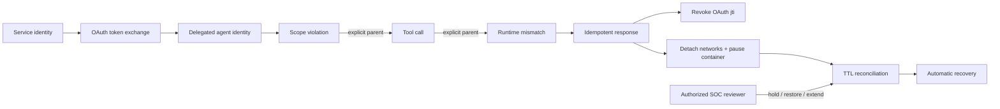

# Phase 14 — Causal Detection & Safe Response

## 목표

Phase 14는 공격을 탐지하는 데서 멈추지 않고 **명시적인 인과관계가 입증된 Critical 사고만 안전하게 차단하고 복구**합니다. 시간상 가까운 이벤트만으로 자동 대응하지 않으며, 위임된 agent identity, OAuth token lineage, runtime event의 부모 관계가 모두 이어져야 대응을 시작합니다.

## 최종 흐름



## Threat → Control → Evidence

| 위협 | 통제 | 증거 |
|---|---|---|
| 같은 시간대의 무관한 이벤트가 공격으로 묶임 | 명시적 parent edge, agent identity, resource가 모두 일치할 때만 causal path 생성 | `time_only_correlation_rejected` |
| 하위 agent가 상위 token보다 넓은 권한 획득 | issuer·audience·parent jti·scope narrowing·최대 depth 검증 | `delegated_identity_verified` |
| 탈취 token 또는 하위 delegated token이 계속 사용됨 | RFC 7662 introspection과 ancestor jti revocation을 MCP 요청마다 fail-closed 확인 | `oauth_token_inactive_after_revocation` |
| 동일 alert 재처리로 반복 격리 | rule·root event·target의 SHA-256 response key | `duplicate_response_suppressed` |
| 잘못된 컨테이너 격리 | Compose project와 관리 label 확인, container ID에 작업 바인딩 | `container_isolation_applied` |
| 영구 격리 또는 성급한 자동 복구 | 제한된 TTL, 자동 복구, 승인된 reviewer의 hold·restore·extend | `ttl_auto_recovery_completed`, `human_override_restored_target` |
| 대응 속도를 측정하지 못함 | causal finding 시각부터 container pause 완료까지 측정 | `detect_to_block_ms` |

## 핵심 구현

### 1. Agent identity와 delegated-token chain

Authorization Server는 OAuth token exchange로 root service token을 agent token에 위임합니다. 하위 token은 부모 `jti`, delegation depth, agent identity를 RS256 JWT에 바인딩하며 scope 확대와 3단계 초과 위임을 차단합니다. Authorization Server의 서명 검증과 introspection을 마친 claim만 `DelegationVerifier`에 전달합니다.

### 2. 시간 기반이 아닌 causal attack graph

`CausalAttackGraph`는 이벤트마다 명시된 부모만 간선으로 사용합니다. 부모가 없거나, agent identity 또는 MCP resource가 바뀌거나, 부모 시각이 자식보다 늦으면 연결을 거부합니다. 수 밀리초 안에 발생한 세 이벤트라도 parent edge가 없으면 공격 체인으로 판정하지 않습니다.

### 3. 즉시 token 폐기와 MCP fail-closed

Response Engine은 bearer token을 증거에 기록하지 않고 메모리의 `jti → token` 매핑으로만 보관합니다. Critical causal finding이 발생하면 전용 responder client로 token을 폐기합니다. MCP verifier는 서명·issuer·audience 검증 후 매 요청마다 introspection을 수행하므로, 현재 token이나 delegation chain의 ancestor jti가 폐기되었거나 Authorization Server에 연결할 수 없으면 token을 거부합니다.

### 4. 가역적인 container·network 격리

Docker 격리는 다음 조건을 모두 만족하는 컨테이너에만 적용됩니다.

- `com.arsl.phase14.managed=true`
- Compose project `agent-runtime-security-lab`
- 안전한 컨테이너 이름
- 최초 inspect에서 얻은 64자리 container ID 유지

모든 연결 네트워크를 분리한 뒤 컨테이너를 pause합니다. 복구 시 동일 container ID와 관리 label을 다시 검증하고 unpause한 뒤 저장된 네트워크만 다시 연결합니다.

### 5. 중복 방지, TTL, human override

Response Engine은 동일 root event와 target에 같은 response key를 생성해 token 폐기와 격리를 한 번만 수행합니다. TTL 만료 시 자동 복구하지만, 승인된 SOC reviewer는 조사 중 `hold`, 즉시 `restore`, 제한된 시간의 `extend`를 적용할 수 있습니다. 컨테이너가 복구되어도 탈취 가능성이 있는 token은 계속 폐기 상태로 남습니다.

## 실행

```powershell
Set-Location D:\develop\agent-runtime-security-lab
powershell -NoProfile -ExecutionPolicy Bypass -File .\scripts\run-phase14-response.ps1
```

스크립트는 ephemeral client secret을 생성하고, 실제 OAuth token exchange·revocation·introspection과 실제 `arsl-mcp-server` 네트워크 분리·pause·복구를 실행합니다. 토큰, secret, raw jti와 tool arguments는 증거 파일에 저장하지 않습니다.

## 검증 결과

- Response Engine, Authorization Server, MCP OAuth 테스트: 43/43 통과
- Response Engine branch coverage: 80% 이상
- delegated identity depth: 1
- causal path: 3 events / 2 explicit edges
- timestamp-only false correlation: 0
- duplicate response: 1건 억제
- 실제 MCP container·network 격리 후 복구
- OAuth token: 복구 이후에도 inactive
- detect-to-block MTTR: 실행마다 기계 판독형 증거에 기록

비식별화된 결과는 [`phase14-safe-response.json`](evidence/phase14-safe-response.json)에 기록합니다.

> 운영 전환 시 주의: 현재 revocation registry는 단일 Authorization Server 프로세스의 메모리에 유지되는 lab 구현입니다. 실제 환경에서는 재시작과 다중 replica에서도 상태가 유지되도록 접근 통제된 공유 저장소와 고가용성 구성이 필요합니다.

## 남은 방향

Phase 15에서는 기능을 추가하지 않고 실행 전·실행 중·실행 후 통제를 하나의 원클릭 데모로 묶고, p50/p95/p99 지연시간, 공격 탐지·대응 시간, CPU·메모리, FPR·recall을 정상/공격 fixture로 측정합니다.
