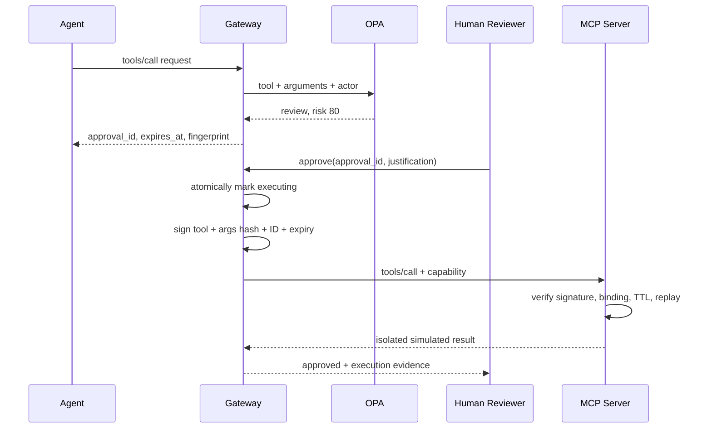

# Phase 2: Runtime Approval Control Plane

Phase 2 turns a policy decision into an enforceable runtime control. A `review` result does not execute a tool. It creates a bounded, expiring approval record that exposes argument keys and a fingerprint, never the raw argument values.

## Approval sequence

## Security invariants

1. `deny` decisions never reach the MCP server.
2. `review` decisions never execute before an explicit approval.
3. The capability contains no raw argument values.
4. A capability cannot be rebound to another tool or argument set.
5. Expired and previously consumed capabilities fail closed.
6. The approval API changes a request from `pending` to `executing` under a lock before I/O, preventing concurrent approval races.
7. MCP is not published to the host network.
8. External HTTP is simulated; the lab sends no external traffic.

## OCSF mapping

Gateway events are exported as OCSF 1.8 `API Activity` (`class_uid: 6003`) with the `ai_operation` profile.

| Lab evidence | OCSF field |
|---|---|
| MCP tool | `api.operation` |
| Agent identity | `actor.user.name` |
| Agent role | `message_context.ai_role_id: 4` |
| Policy action | `unmapped.security.policy_action` |
| Risk score | `severity_id` plus `unmapped.security.risk_score` |
| Argument evidence | `unmapped.security.argument_fingerprint` |
| Approval correlation | `unmapped.security.approval_id` |

The `unmapped` object preserves lab-specific evidence without pretending that it is a native OCSF attribute. Raw arguments and tool output are intentionally excluded from the normalized event.

## API surface

| Method | Path | Purpose |
|---|---|---|
| `GET` | `/api/approvals` | List redacted approval records |
| `POST` | `/api/approvals/{id}/approve` | Consume an approval and execute once |
| `POST` | `/api/approvals/{id}/deny` | Record explicit human denial |
| `GET` | `/api/events/ocsf` | Export normalized OCSF 1.8 events |

## Current limitations

- Approval and event storage is in-memory for a deterministic local lab.
- The dashboard has no user authentication and is bound to localhost only.
- Capability state is local to one MCP server process; a distributed deployment needs a shared atomic nonce store.
- The MCP authorization layer is a Phase 3 item and should use OAuth 2.1 audience-bound tokens in production.
