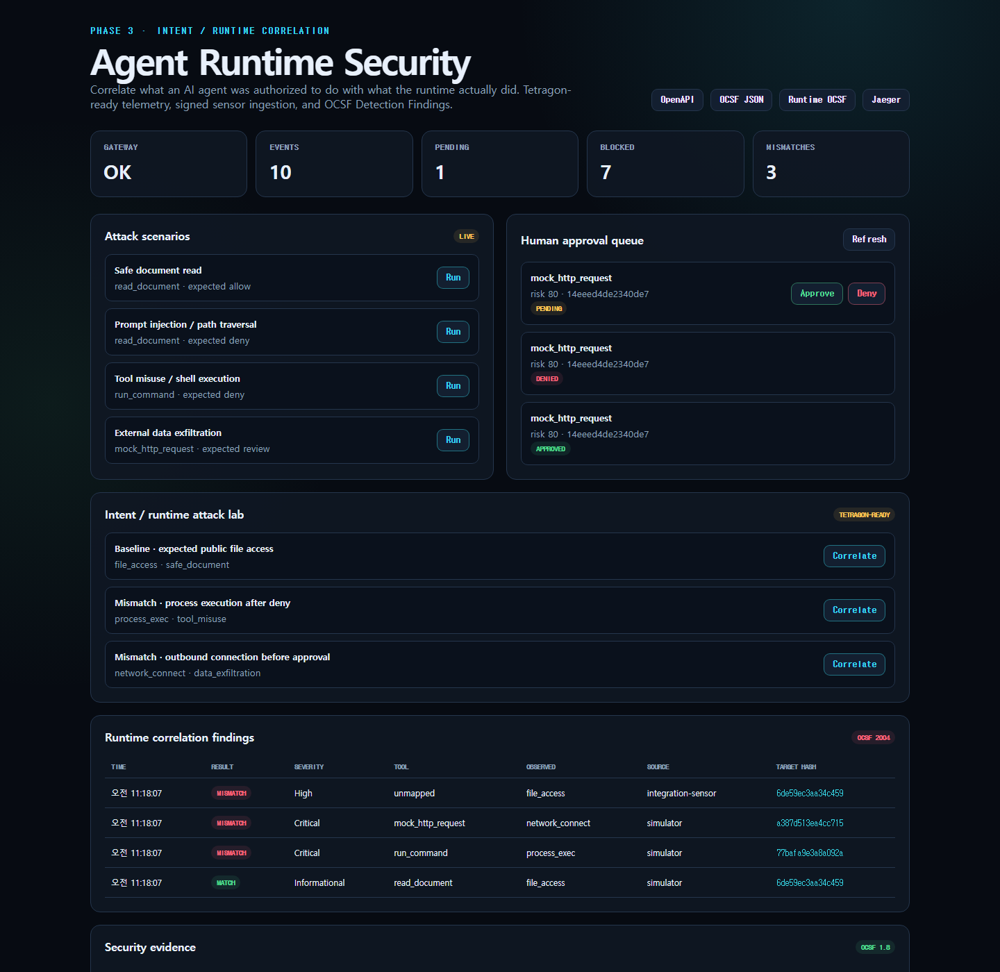
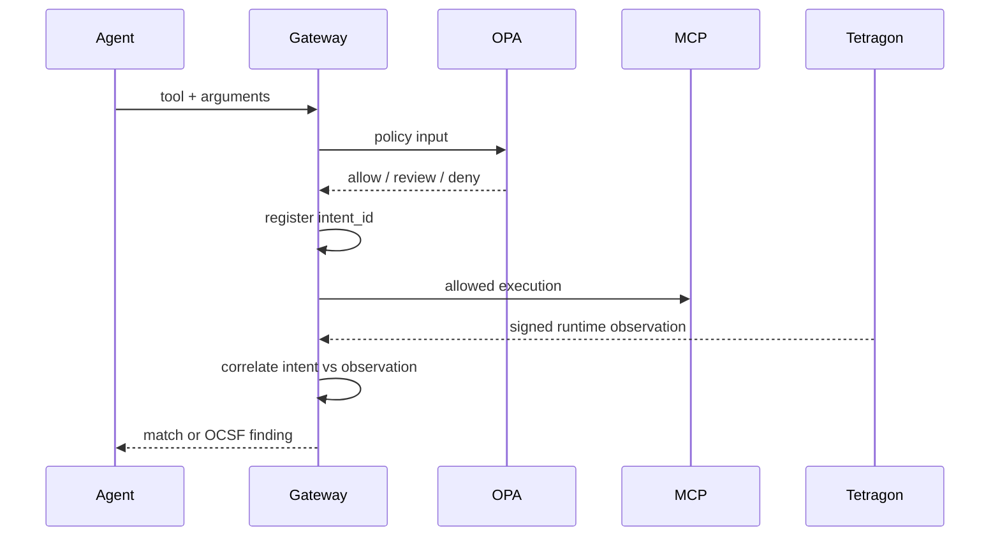

# Phase 3 — Intent / Runtime Correlation

## Goal

Phase 2는 Agent Gateway에서 도구 호출을 통제했습니다. Phase 3는 통제 기록만 신뢰하지 않고, Agent가 허가받은 행동과 컨테이너 런타임에서 관측된 행동을 독립적으로 비교합니다.

핵심 질문은 하나입니다.

> “Agent가 하겠다고 승인받은 일과 Linux 커널이 본 일이 같은가?”



## Detection flow

1. Gateway가 OPA 결정을 받은 직후 `intent_id`를 기록합니다.
2. 허가된 도구별 예상 event type과 target 범위를 생성합니다.
3. Tetragon 또는 시뮬레이터가 runtime observation을 전송합니다.
4. Gateway가 sensor HMAC을 검증합니다.
5. Correlator가 intent와 observation을 비교합니다.
6. 결과를 OCSF 1.8 Detection Finding으로 내보냅니다.



## Correlation rules

| Intent | Observation | Finding |
|---|---|---|
| Executed `read_document` | `file_access` under `/app/documents/public/` | Informational match |
| Denied/review tool | Any runtime event | Critical mismatch |
| Any current isolated tool | `process_exec` | Critical mismatch |
| Simulated HTTP tool | `network_connect` | Critical mismatch |
| Expected event, wrong target | High mismatch |
| Unknown `intent_id` | High orphan activity |

현재 MCP HTTP 도구는 외부 패킷을 보내지 않고 응답만 모의 생성하므로 실제 `network_connect`는 정상 동작이 아닙니다.

## Runtime observation contract

```json
{
  "intent_id": "gateway-event-uuid",
  "source": "tetragon",
  "timestamp": "2026-07-24T00:00:00Z",
  "event_type": "process_exec",
  "process": "/bin/sh",
  "target": "/bin/sh",
  "container": "arsl-mcp-server"
}
```

`POST /api/runtime/observations`는 원문 JSON bytes에 대한 SHA-256 HMAC을 `X-Sensor-Signature` 헤더로 요구합니다. Approval capability와 sensor key를 분리해 하나의 키가 노출돼도 다른 신뢰 경계까지 위조하지 못하게 했습니다.

## Tetragon integration

Tetragon은 기본 process lifecycle event와 TracingPolicy의 kprobe/tracepoint/LSM hook을 이용해 커널 이벤트를 생성합니다. 이 저장소의 adapter는 다음 JSON event를 정규화합니다.

- `process_exec` → `process_exec`
- `process_kprobe.security_file_permission` → `file_access`
- `process_kprobe.tcp_connect` → `network_connect`

정책 파일:

```bash
kubectl apply -f deploy/tetragon/runtime-observation.yaml
```

Adapter dry run:

```bash
tetra getevents -o json | python sensor/tetragon_adapter.py \
  --intent-id '<intent-id>' --dry-run
```

Tetragon 공식 문서 기준 최소 Linux kernel은 4.19이며 BTF가 필요합니다. `/sys/kernel/btf/vmlinux`가 있는지 먼저 확인합니다.

```bash
uname -r
test -r /sys/kernel/btf/vmlinux && echo BTF_OK
```

Docker Desktop은 Linux VM의 커널 기능과 BTF 노출 여부가 버전별로 달라질 수 있고 실센서에는 privileged/host namespace 접근이 필요합니다. 따라서 기본 Compose에 privileged 센서를 숨겨 넣지 않았습니다. Windows/CI 검증은 동일 correlation 경로를 사용하는 결정론적 시뮬레이터로 수행하고, 실제 Tetragon은 Linux/Kubernetes 전용 선택 통합으로 분리했습니다.

## API

| Endpoint | Purpose |
|---|---|
| `GET /api/runtime/intents` | 최근 실행 의도 |
| `POST /api/runtime/observations` | HMAC 서명 sensor 수집 |
| `GET /api/runtime/observations` | 최근 runtime telemetry |
| `GET /api/runtime/findings` | 상관분석 결과 |
| `GET /api/runtime/ocsf` | OCSF Detection Finding |
| `POST /api/runtime/scenarios/{id}` | 결정론적 Phase 3 데모 |

## OCSF mapping

Runtime 결과는 OCSF 1.8 `Detection Finding` (`class_uid: 2004`)으로 변환합니다. mismatch는 `is_alert: true`, 정상 match는 `is_alert: false`입니다.

개인정보와 민감 데이터 최소화를 위해 다음 값은 OCSF에 원문으로 저장하지 않습니다.

- tool arguments
- process command/arguments
- file path 또는 network destination

대신 `target_fingerprint`와 `argument_fingerprint`를 사용해 동일 행위를 추적할 수 있게 합니다.

## Test evidence

Local verification environment (2026-07-24):

| Item | Result |
|---|---|
| Docker Desktop Engine | `24.0.6` |
| WSL2 kernel | `6.18.33.2-microsoft-standard-WSL2` |
| Architecture | `x86_64` |
| Kernel BTF | `/sys/kernel/btf/vmlinux`, readable |
| Default Compose privilege | No privileged container; all app capabilities dropped |

`scripts/verify-lab.ps1`이 다음을 자동 검증합니다.

- 정상 file intent/observation match
- deny 뒤 process execution mismatch
- review gate 이전 network connection mismatch
- 올바른 sensor HMAC 수락
- OCSF Detection Finding class와 raw target 비노출
- Phase 2 approve/deny/replay 방어 회귀 테스트

## Limitations and next steps

- 현재 실습 correlation은 `intent_id`를 capture session에 명시적으로 연결합니다.
- 운영 환경에서는 trace/span ID, cgroup ID, container ID와 time window를 함께 사용해야 합니다.
- observation은 프로세스 메모리의 악성 동작 자체를 증명하지 않으며 커널 hook이 관측한 행위만 나타냅니다.
- event loss, clock skew, sensor health를 별도 신뢰 신호로 추가해야 합니다.
- 다음 단계는 Kubernetes에서 Tetragon 실센서 E2E, Elasticsearch/Kibana hunt dashboard, OWASP/MITRE 자동 매핑입니다.

## Official references

- [Tetragon installation](https://tetragon.io/docs/installation/)
- [Tetragon FAQ: kernel and BTF requirements](https://tetragon.io/docs/installation/faq/)
- [Tetragon TracingPolicy](https://tetragon.io/docs/concepts/tracing-policy/)
- [Tetragon observability policies](https://tetragon.io/docs/policy-library/observability/)
- [OCSF schema 1.8](https://github.com/ocsf/ocsf-schema/releases/tag/1.8.0)
