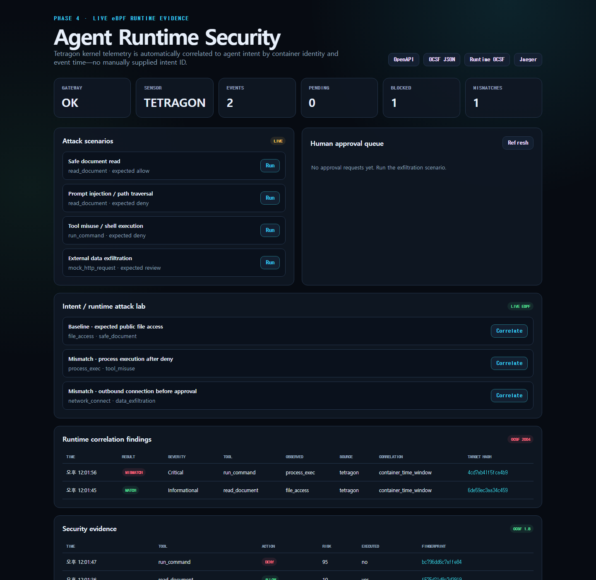
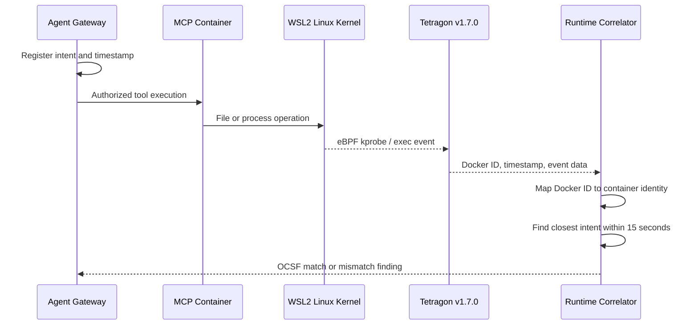

# Phase 4 — Live Tetragon eBPF Validation

## Outcome

Phase 4는 Phase 3의 시뮬레이션 경로를 실제 Linux kernel telemetry로 교체해 검증합니다. Windows Docker Desktop 내부 WSL2 커널에 Tetragon v1.7.0을 attach하고, MCP 컨테이너에서 발생한 file access와 process execution을 수집했습니다.



검증 결과:

| Kernel event | Agent intent | Correlation | Result |
|---|---|---|---|
| `security_file_permission` | Allowed `read_document` | Container + 110 ms | Informational match |
| `process_exec` | Denied `run_command` | Container + 476 ms | Critical mismatch |

원본 검증 요약은 [`evidence/phase4-tetragon-validation.json`](evidence/phase4-tetragon-validation.json)에 저장했습니다. 파일 경로와 process target은 fingerprint만 남겼습니다.

## Architecture



## What changed from Phase 3

Phase 3 sensor payload는 `intent_id`를 명시적으로 전달했습니다. Phase 4에서는 이 값이 없어도 다음 조건으로 자동 연결합니다.

1. Tetragon event의 Docker ID를 `arsl-mcp-server` identity로 정규화
2. observation과 동일한 container를 대상으로 하는 최근 intent 선택
3. event time이 intent 생성 1초 전부터 15초 후 사이인지 확인
4. 가장 가까운 intent에 연결하고 `correlation_delta_ms` 기록
5. 후보가 없으면 `orphan_runtime_activity`로 분류

Observation에는 correlation 근거가 남습니다.

```json
{
  "source": "tetragon",
  "event_type": "process_exec",
  "container": "arsl-mcp-server",
  "correlation_method": "container_time_window",
  "correlation_delta_ms": 476
}
```

## Reproduce

먼저 기본 Lab을 실행합니다.

```powershell
powershell -NoProfile -ExecutionPolicy Bypass -File .\scripts\run-lab.ps1
```

실제 eBPF 검증을 실행합니다.

```powershell
powershell -NoProfile -ExecutionPolicy Bypass -File .\scripts\verify-tetragon.ps1
```

센서도 함께 중지하려면 다음과 같이 실행합니다.

```powershell
powershell -NoProfile -ExecutionPolicy Bypass `
  -File .\scripts\verify-tetragon.ps1 `
  -StopSensor
```

## E2E procedure

`verify-tetragon.ps1`은 다음 단계를 자동화합니다.

1. Docker Engine과 Agent Gateway health 확인
2. 공식 Tetragon v1.7.0 이미지 실행
3. `/sys/kernel/btf/vmlinux` 확인과 base eBPF sensor attach 대기
4. monitor-only `arsl-runtime-observation` TracingPolicy 적용
5. sensor가 process cache를 채우도록 Agent/MCP 재시작
6. Tetragon JSON을 bounded capture로 수집
7. Docker ID를 container name으로 자동 매핑
8. HMAC 서명 adapter를 통해 Gateway로 전송
9. 실제 match와 Critical mismatch 검증

## Trust boundary

Tetragon은 eBPF 프로그램을 커널에 load하기 때문에 공식 Docker 설치 방식과 동일하게 다음 권한이 필요합니다.

- `--privileged`
- `--pid=host`
- `--cgroupns=host`
- host kernel BTF read-only mount

이 권한은 `arsl-tetragon` 센서 컨테이너에만 적용됩니다. 기본 `compose.yaml`에는 privileged service가 없으며 다음 app hardening은 유지됩니다.

| Container | User | Root FS | Capabilities | Host port |
|---|---|---|---|---|
| Agent Gateway | `65532:65532` | Read-only | `ALL` dropped | `127.0.0.1:8080` |
| MCP Server | `65532:65532` | Read-only | `ALL` dropped | None |

## TracingPolicy

[`deploy/tetragon/runtime-observation.yaml`](../deploy/tetragon/runtime-observation.yaml)은 enforcement action이 없는 `monitor_only` policy입니다.

- `security_file_permission`: `/app/documents/` 접근
- `tcp_connect`: TCP connection metadata
- 기본 Tetragon base sensor: `process_exec`

실습 공격을 차단하는 책임은 계속 OPA/MCP control plane에 있습니다. Tetragon은 Phase 4에서 독립 증거 수집기 역할을 합니다.

## Verified environment

| Item | Value |
|---|---|
| Validation date | 2026-07-24 |
| Tetragon | v1.7.0 |
| Image digest | `sha256:deda51c3f88e4d26b4d76c99ea207f2b05f9e40c210e0f04a37ca632ab7bf527` |
| Docker Engine | 24.0.6 |
| Kernel | `6.18.33.2-microsoft-standard-WSL2` |
| BTF | Readable |
| Cgroup | v2 |
| TracingPolicy | enabled / monitor-only |

## CI strategy

GitHub-hosted runner는 커널 eBPF 권한과 환경이 보장되지 않습니다. 따라서 CI에서는 다음을 검증합니다.

- auto-correlation algorithm unit tests
- Tetragon JSON normalization tests
- PowerShell E2E script syntax
- signed sensor API와 OCSF 회귀 테스트

실제 eBPF attach는 `verify-tetragon.ps1`과 저장된 fingerprint evidence로 별도 증명합니다. 이를 CI 통과로 가장하지 않습니다.

## Limitations

- Container + time window만으로는 동시 실행량이 높은 운영 환경에서 잘못 연결될 수 있습니다.
- 다음 단계에서는 OpenTelemetry trace ID, cgroup ID, container ID를 조합해야 합니다.
- Tetragon을 workload보다 늦게 시작하면 process metadata가 부족할 수 있어 검증 스크립트가 app을 재시작합니다.
- `tcp_connect`에는 OTel/OPA/MCP 내부 트래픽도 포함되므로 production에서는 destination allowlist와 policy filtering이 필요합니다.
- Phase 4는 Docker Desktop 실센서 검증이며 Kubernetes Runtime Hook 검증은 다음 하위 단계입니다.

## Official references

- [Tetragon quick Docker install](https://tetragon.io/docs/getting-started/install-docker/)
- [Tetragon container deployment](https://tetragon.io/docs/installation/container/)
- [Tetragon TracingPolicy](https://tetragon.io/docs/concepts/tracing-policy/)
- [Tetragon kernel and BTF requirements](https://tetragon.io/docs/installation/faq/)
