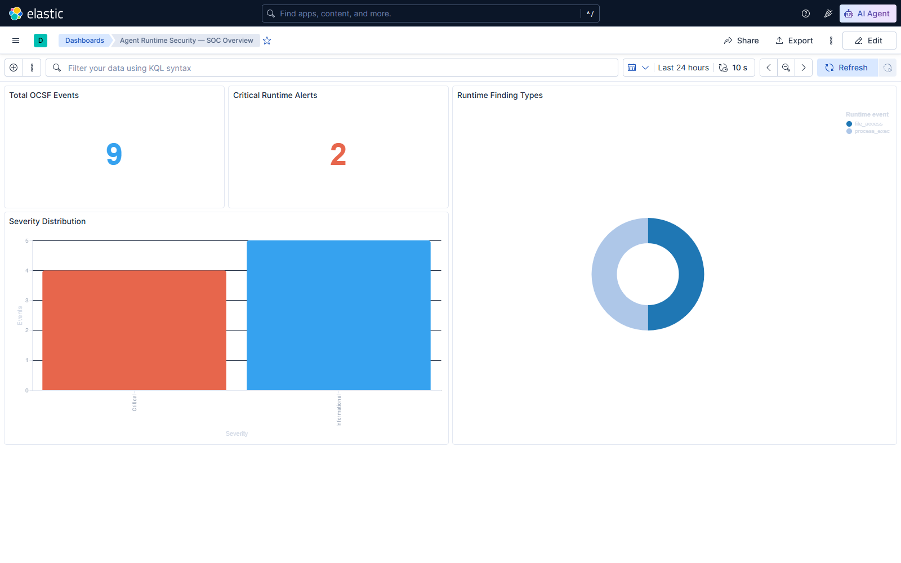
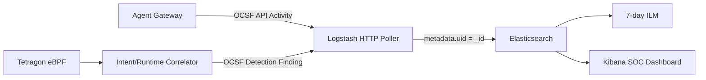

# Phase 5 — OCSF SOC Pipeline

Phase 5는 Phase 4의 실제 Tetragon eBPF 관측 결과를 SOC 분석 계층으로 전달합니다. Agent Gateway가 제공하는 OCSF 1.8 API Activity와 Detection Finding을 Logstash가 수집하고, Elasticsearch가 보존하며, Kibana가 탐지 현황과 런타임 행위를 시각화합니다.



## 목표

- 실제 agent intent와 eBPF runtime finding을 한 인덱스에서 탐색
- 원본 도구 인자와 runtime target이 저장 계층으로 넘어가지 않는지 검증
- 폴링 방식 수집에서도 동일 이벤트가 중복되지 않도록 보장
- 누구나 재현 가능한 saved object와 자동 설치 스크립트 제공
- 기존 경량 랩과 Elastic Stack의 자원 사용을 `soc` 프로필로 분리

## 데이터 흐름



Logstash는 다음 엔드포인트를 5초 간격으로 수집합니다.

- `/api/events/ocsf`: OCSF class 6003 API Activity
- `/api/runtime/ocsf`: OCSF class 2004 Detection Finding

`metadata.uid`를 Elasticsearch `_id`로 사용합니다. 동일 배열을 반복 수집하더라도 기존 문서가 갱신될 뿐 문서 수가 늘지 않습니다.

## 실행

```powershell
Set-Location D:\develop\agent-runtime-security-lab
powershell -NoProfile -ExecutionPolicy Bypass -File .\scripts\run-lab.ps1
powershell -NoProfile -ExecutionPolicy Bypass -File .\scripts\verify-tetragon.ps1
powershell -NoProfile -ExecutionPolicy Bypass -File .\scripts\run-soc.ps1
```

접속 주소:

| Service | URL | Exposure |
|---|---|---|
| Kibana | http://127.0.0.1:15601 | loopback only |
| Elasticsearch | http://127.0.0.1:19200 | loopback only |
| Logstash API | http://127.0.0.1:19600 | loopback only |

포트는 `ARSL_KIBANA_PORT`, `ARSL_ELASTICSEARCH_PORT`, `ARSL_LOGSTASH_PORT` 환경 변수로 변경할 수 있습니다.

## 실제 검증 결과

2026-07-24 Docker Desktop WSL2 환경에서 다음을 확인했습니다.

| Check | Result |
|---|---|
| Elastic Stack | Elasticsearch/Kibana/Logstash 9.4.2 |
| Elasticsearch health | green |
| Indexed OCSF documents | 9 |
| Unique `metadata.uid` | 9 |
| API Activity | 5 |
| Detection Finding | 4 |
| Critical alert | 2 |
| Repeat polling | 12초 전후 9 → 9, duplicate 없음 |
| Sensitive raw values | index에서 미검출 |
| Retention | `arsl-ocsf-7d` ILM |
| Dashboard | saved object 자동 import 및 실제 렌더링 성공 |

실행 가능한 증거는 [phase5-soc-validation.json](evidence/phase5-soc-validation.json)에 저장했습니다.

## 대시보드

Kibana saved object는 저장소의 [arsl-soc-dashboard.ndjson](../deploy/kibana/arsl-soc-dashboard.ndjson)으로 관리합니다.

- Total OCSF Events
- Critical Runtime Alerts
- Severity Distribution
- Runtime Finding Types
- 24시간 기본 time filter와 10초 자동 새로고침

## 보안 경계

- Elastic Stack 관리 포트는 모두 `127.0.0.1`에만 바인딩합니다.
- MCP 서버는 계속 호스트 포트를 공개하지 않습니다.
- OCSF 문서에는 원본 인자와 runtime target 대신 fingerprint만 저장합니다.
- Logstash는 UID 기반 idempotent indexing을 사용합니다.
- 인덱스 템플릿은 OCSF 핵심 필드를 명시적으로 매핑합니다.
- ILM은 실습 데이터의 보존 기간을 7일로 제한합니다.

현재 Elastic 보안 기능은 재현 가능한 단일 호스트 실습을 위해 비활성화되어 있습니다. 모든 포트가 loopback으로 제한되어 있지만 운영 환경에서는 TLS, 사용자 인증, API key, secret store를 반드시 적용해야 합니다.

## 검증 명령

```powershell
docker compose --profile soc config --quiet
powershell -NoProfile -ExecutionPolicy Bypass -File .\scripts\verify-soc.ps1
```

`verify-soc.ps1`는 서비스 상태, saved dashboard, OCSF class별 문서, UID 중복, Critical finding, 개인정보 경계, index template, ILM 정책을 검사합니다.

## 포트폴리오 포인트

이 단계의 차별점은 단순 Kibana 화면이 아니라 커널 eBPF 증거가 정책 intent와 자동 상관분석된 뒤 표준화된 OCSF 문서로 SOC까지 전달된다는 점입니다. 또한 검증 스크립트가 데이터 중복과 개인정보 경계를 실패 조건으로 다루기 때문에 관측 가능성과 보안 통제를 함께 보여줍니다.

## 참고

- [Elastic Stack version compatibility](https://www.elastic.co/guide/en/elastic-stack/current/installing-elastic-stack.html)
- [Logstash HTTP poller input](https://www.elastic.co/docs/reference/logstash/plugins/plugins-inputs-http_poller)
- [Kibana saved object import](https://www.elastic.co/docs/api/doc/kibana/v8/operation/operation-importsavedobjectsdefault)
