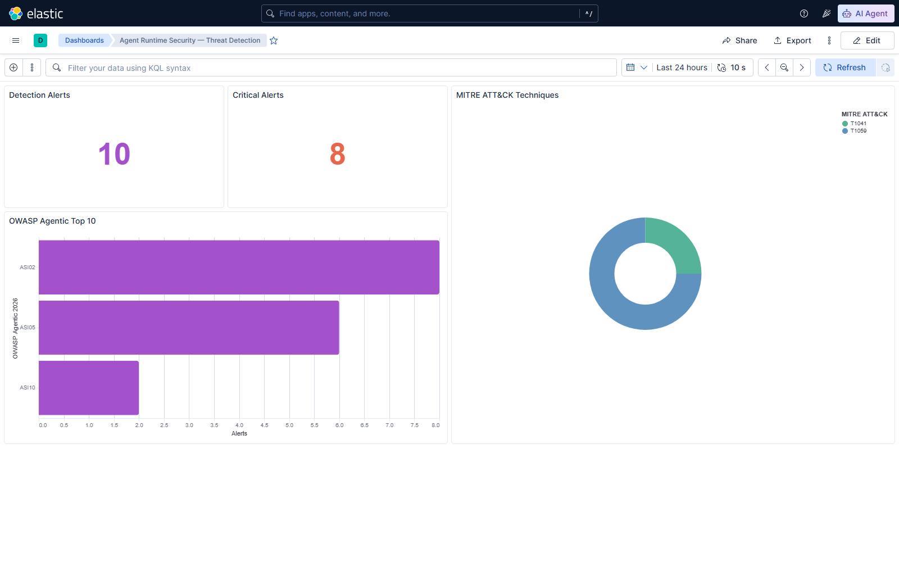
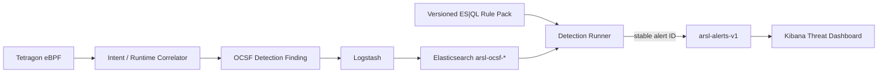

# Phase 6 — Detection-as-Code & Threat Mapping

Phase 6는 Phase 5에서 수집한 OCSF 런타임 finding을 실제 탐지 규칙과 경보로 바꿉니다. 규칙은 Git에서 리뷰 가능한 ES|QL detection-as-code로 관리하고, 각 경보를 OWASP Agentic Top 10 (2026)과 MITRE ATT&CK에 연결합니다.



## 핵심 성과

- OCSF Detection Finding에 표준 `finding_info.attacks` 객체 추가
- 정책 거부 후 프로세스 실행, 승인 전 네트워크 연결, orphan runtime activity 탐지
- OWASP Agentic Top 10 2026의 ASI02·ASI05·ASI10 자동 분류
- MITRE ATT&CK T1059·T1041 매핑
- ES|QL rule pack, 경보 인덱스 template, 실행기, Kibana saved object를 코드로 관리
- `rule.id + source.uid` 기반 결정론적 alert ID로 반복 실행 시 중복 방지
- 원본 프롬프트·도구 인자·파일 경로·목적지 대신 fingerprint와 분류 정보만 저장

## 탐지 아키텍처



로컬 랩은 인증을 끈 단일 노드 Elastic을 사용하므로 Kibana Detection Engine API 대신 동일한 ES|QL을 REST API로 실행하는 경량 runner를 사용합니다. 운영 환경에서는 Elastic Security API key, detection-engine privileges, TLS를 적용하고 같은 쿼리를 native ES|QL rule로 배포할 수 있습니다.

## 규칙과 위협 모델

| Rule ID | 조건 | Severity / Risk | OWASP Agentic 2026 | MITRE ATT&CK |
|---|---|---:|---|---|
| `arsl-denied-process-execution` | `process_exec` + policy `deny` | Critical / 95 | ASI05 Unexpected Code Execution, ASI02 Tool Misuse | TA0002 / T1059 |
| `arsl-network-before-approval` | `network_connect` + policy `review` | Critical / 90 | ASI02 Tool Misuse | TA0010 / T1041 |
| `arsl-orphan-runtime-activity` | intent 없는 runtime event | High / 80 | ASI10 Rogue Agents | 해당 없음 |

파일 접근 finding은 OCSF에 ASI01 Agent Goal Hijack과 TA0009/T1005를 매핑하지만, 정상·비정상 경로 판별에 필요한 allowlist가 없는 경우 오탐을 피하기 위해 Phase 6 alert rule에서는 제외했습니다.

## 실행

```powershell
Set-Location D:\develop\agent-runtime-security-lab
powershell -NoProfile -ExecutionPolicy Bypass -File .\scripts\run-lab.ps1
powershell -NoProfile -ExecutionPolicy Bypass -File .\scripts\run-soc.ps1
powershell -NoProfile -ExecutionPolicy Bypass -File .\scripts\run-detections.ps1
```

- Threat dashboard: <http://127.0.0.1:15601/app/dashboards#/view/arsl-threat-mapping>
- Rule pack: [`deploy/elastic/detection-rules/agent-runtime-rules.json`](../deploy/elastic/detection-rules/agent-runtime-rules.json)
- Runner: [`detection/esql_runner.py`](../detection/esql_runner.py)

dry-run으로 원본 인덱스를 변경하지 않고 매칭 결과를 확인할 수도 있습니다.

```powershell
python .\detection\esql_runner.py `
  --elasticsearch http://127.0.0.1:19200 `
  --rules .\deploy\elastic\detection-rules\agent-runtime-rules.json `
  --dry-run
```

## 실제 검증 결과

2026-07-24 Docker Desktop WSL2와 Elastic Stack 9.4.2 환경에서 기본 시나리오와 실 Tetragon 회귀를 연속 실행한 Phase 6 snapshot입니다.

| Check | Result |
|---|---|
| Versioned ES|QL rules | 3 |
| Created alerts | 10 |
| Unique rule/source pairs | 10 |
| Critical alerts | 8 |
| Rule distribution | denied process 6, network-before-approval 2, orphan 2 |
| OWASP mappings | ASI02, ASI05, ASI10 |
| MITRE mappings | T1041, T1059 |
| Repeat execution | 10 → 10, duplicate 없음 |
| Raw sensitive values | alert index에서 미검출 |
| Kibana | saved object import와 실제 렌더링 성공 |

기계 판독 가능한 결과와 screenshot hash는 [`phase6-threat-detection.json`](evidence/phase6-threat-detection.json)에 저장했습니다.

## 검증

```powershell
powershell -NoProfile -ExecutionPolicy Bypass -File .\scripts\verify-detections.ps1
python -m unittest discover -s detection/tests -v
```

검증 스크립트는 rule pack과 대시보드 자산, rule별 alert, OWASP/MITRE 매핑, 결정론적 중복 방지, 개인정보 경계를 함께 검사합니다.

## 한계와 다음 단계

- 현재 rule은 polling/batch 실행 방식입니다. 운영형에서는 Elastic native detection scheduling과 alert action을 사용해야 합니다.
- 데모의 OCSF source는 단일 로컬 agent입니다. Kubernetes Phase에서는 namespace, pod UID, service account를 correlation key에 포함해야 합니다.
- T1041은 승인 전 outbound connection을 데이터 유출 징후로 보는 보수적 매핑입니다. payload 전송을 확인한 사실로 해석하면 안 됩니다.
- 다음 Phase는 Kind/Kubernetes에서 agent workload identity와 eBPF event를 연결하고, namespace 단위 정책 우회를 탐지합니다.

## 기준 자료

- [OWASP Top 10 for Agentic Applications 2026](https://genai.owasp.org/2025/12/09/owasp-top-10-for-agentic-applications-the-benchmark-for-agentic-security-in-the-age-of-autonomous-ai/)
- [Elastic ES|QL detection rules](https://www.elastic.co/docs/solutions/security/detect-and-alert/esql)
- [MITRE ATT&CK T1059](https://attack.mitre.org/techniques/T1059/)
- [MITRE ATT&CK T1041](https://attack.mitre.org/techniques/T1041/)
- [OCSF 1.8 schema](https://github.com/ocsf/ocsf-schema/releases)
