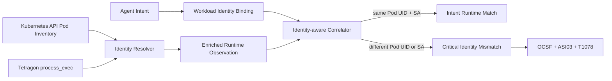

# Phase 7 — Kubernetes Workload Identity Correlation

Phase 7은 컨테이너 이름과 시간만 사용하던 correlation을 Kubernetes의 불변 workload identity까지 확장합니다. Agent intent에 `Cluster + Namespace + Pod UID + ServiceAccount + Container`를 바인딩하고, Tetragon eBPF 이벤트가 다른 Pod 또는 ServiceAccount에서 발생하면 Critical identity mismatch로 탐지합니다.


## 왜 필요한가

컨테이너 이름은 재사용될 수 있고 Pod 이름만으로는 재생성된 workload를 구분하기 어렵습니다. 또한 같은 namespace 안에서도 ServiceAccount에 따라 권한이 달라집니다. 따라서 “어떤 도구가 허용됐는가”뿐 아니라 “정확히 어떤 workload identity가 실행했는가”를 검증해야 합니다.

Phase 7의 correlation key:

```text
cluster / namespace / pod_uid / service_account / container_name
```

Pod 이름도 분석 정보로 저장하지만 보안 판정에는 Kubernetes가 생성한 Pod UID를 포함합니다. Identity 정보가 일부 누락되면 fail-closed로 처리하며 허용 intent와 자동 연결하지 않습니다.

## 아키텍처



Tetragon 이벤트 자체의 Pod namespace/name/container 메타데이터를 Kubernetes API의 Pod inventory와 결합해 Pod UID와 ServiceAccount를 확정합니다. 원본 process arguments는 finding 또는 OCSF로 내보내지 않습니다.

## 실습 시나리오

전용 Kind 클러스터 `arsl-phase7` 안에 동일 이미지와 container name을 가진 두 Pod를 배포합니다.

| Workload | ServiceAccount | Intent binding | Expected result |
|---|---|---|---|
| `approved-tool` | `agent-tools` | 승인된 Pod UID에 바인딩 | `intent_runtime_match` |
| `shadow-runner` | `untrusted-runner` | 승인 intent ID를 재사용 | Critical `workload_identity_mismatch` |
| `shadow-runner` | `untrusted-runner` | intent 없음 | High `orphan_runtime_activity` |

두 Pod는 `runAsNonRoot`, `seccompProfile: RuntimeDefault`, read-only root filesystem, `allowPrivilegeEscalation: false`, `capabilities.drop: ALL`, ServiceAccount token automount 비활성화를 적용했습니다.

## 실행

요구사항:

- Docker Desktop 또는 Linux Docker Engine, 권장 메모리 6GB 이상
- Kind 0.32+
- kubectl은 Kubernetes server와 ±1 minor 이내
- Helm 3 또는 4

```powershell
Set-Location D:\develop\agent-runtime-security-lab
powershell -NoProfile -ExecutionPolicy Bypass -File .\scripts\run-kubernetes.ps1
```

스크립트가 수행하는 작업:

1. 전용 Kind 클러스터 생성 또는 readiness 확인
2. 공식 Helm chart로 Tetragon 1.7.0 설치
3. hardened approved/shadow Pod 배포
4. Pod UID와 ServiceAccount inventory 캡처
5. 두 Pod에서 실제 `/bin/echo` process 생성
6. Tetragon JSON `process_exec` event 수집
7. identity-aware correlation과 OWASP/MITRE mapping 검증

클러스터를 제거하려면 정확한 Phase 7 이름만 허용하는 스크립트를 사용합니다.

```powershell
powershell -NoProfile -ExecutionPolicy Bypass -File .\scripts\stop-kubernetes.ps1
```

## 실제 검증 결과

2026-07-24 Windows Docker Desktop WSL2 환경에서 검증했습니다.

| Check | Result |
|---|---|
| Kind | 0.32.0 |
| Kubernetes | 1.36.1, single control-plane |
| Tetragon | 1.7.0 Helm release, DaemonSet 1/1 Ready |
| Workload Pods | 2/2 Ready |
| Tetragon events scanned | 4 |
| Approved identity | `approved-tool` / `agent-tools` → matched |
| Shadow identity | `shadow-runner` / `untrusted-runner` → Critical mismatch |
| Orphan execution | detected |
| Threat mapping | OWASP ASI03, MITRE ATT&CK T1078 |
| Raw process arguments in exported finding | 없음 |
| Repeat automation | 기존 cluster/release/workload에서 재실행 성공 |

실행 증거와 artifact hash는 [`phase7-kubernetes-identity.json`](evidence/phase7-kubernetes-identity.json)에 기록했습니다.

## 코드 구조

- [`agent-api/app/runtime.py`](../agent-api/app/runtime.py): identity validation, matching, fail-closed correlation
- [`sensor/kubernetes_identity.py`](../sensor/kubernetes_identity.py): Pod inventory resolver
- [`sensor/tetragon_adapter.py`](../sensor/tetragon_adapter.py): Tetragon event identity enrichment
- [`kubernetes/identity_verifier.py`](../kubernetes/identity_verifier.py): 실 이벤트 시나리오 검증
- [`deploy/kubernetes/phase7-workloads.yaml`](../deploy/kubernetes/phase7-workloads.yaml): hardened workload assets
- [`scripts/run-kubernetes.ps1`](../scripts/run-kubernetes.ps1): end-to-end automation

## 위협 프레임워크

- **OWASP ASI03 — Identity & Privilege Abuse**: 다른 ServiceAccount/Pod identity가 승인된 agent intent를 사용
- **MITRE ATT&CK T1078 — Valid Accounts**: 유효한 workload account를 이용해 기존 접근 제어를 우회하는 행위로 매핑

이 매핑은 credential 탈취를 직접 입증한다는 의미가 아닙니다. 관측된 신원이 intent에 바인딩된 신원과 달라 유효한 계정/권한이 오용됐을 가능성을 나타냅니다.

## 한계와 다음 단계

- 현재 Pod inventory는 검증 시점 snapshot입니다. 운영 환경에서는 informer/watch 기반 cache와 Pod 삭제 tombstone 처리가 필요합니다.
- 단일 노드 Kind 실습이며 multi-cluster SPIFFE/SPIRE identity는 포함하지 않았습니다.
- 다음 Phase는 Kubernetes audit log와 agent action을 결합해 ServiceAccount token 사용 및 RBAC 권한 상승을 추적합니다.

## 기준 자료

- [Tetragon Kubernetes deployment](https://tetragon.io/docs/installation/kubernetes/)
- [Tetragon events and Kubernetes metadata](https://tetragon.io/docs/concepts/events/)
- [Kubernetes ServiceAccounts](https://kubernetes.io/docs/tasks/configure-pod-container/configure-service-account/)
- [OWASP Agentic Top 10 2026](https://genai.owasp.org/2025/12/09/owasp-top-10-for-agentic-applications-the-benchmark-for-agentic-security-in-the-age-of-autonomous-ai/)
- [MITRE ATT&CK T1078](https://attack.mitre.org/techniques/T1078/)
