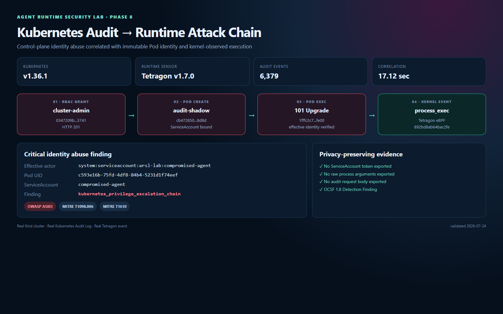
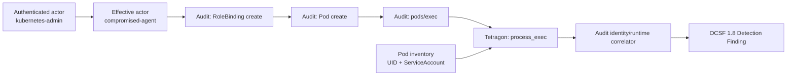

# Phase 8 — Kubernetes Audit/RBAC Attack Chain

Phase 8은 Kubernetes 제어 평면에서 발생한 **권한 변경**과 데이터 평면의 **실제 프로세스 실행**을 하나의 탐지 사건으로 연결한다. 단순히 "RoleBinding이 생성됐다" 또는 "컨테이너에서 프로세스가 실행됐다"를 따로 알리는 것이 아니라, 동일한 ServiceAccount가 권한을 획득하고 Pod를 만든 뒤 실행까지 도달했다는 전체 인과관계를 증명한다.



## 검증 결과

2026-07-24 실제 Kind/Kubernetes 1.36.1 환경에서 다음 체인을 재현하고 탐지했다.

| 순서 | 증거 | 결과 |
|---|---|---|
| 1 | `compromised-agent`가 `shadow-cluster-admin` RoleBinding 생성 | HTTP 201 |
| 2 | 동일 유효 신원이 `audit-shadow` Pod 생성 | HTTP 201 |
| 3 | 동일 유효 신원이 `pods/exec` 연결 | HTTP 101 Protocol Upgrade |
| 4 | Tetragon이 해당 Pod의 `process_exec` 관측 | Pod UID 일치 |
| 5 | 상관분석기가 전체 체인을 Critical finding으로 생성 | 17.124초 |

- Kubernetes Audit 이벤트 스캔: **6,379건**
- Tetragon 이벤트 스캔: **13건**
- Finding: `kubernetes_privilege_escalation_chain`
- OWASP Agentic: **ASI03 Identity & Privilege Abuse**
- MITRE ATT&CK: **T1098.006 Additional Container Cluster Roles**, **T1610 Deploy Container**
- 원본 검증 자산: [`phase8-kubernetes-audit-chain.json`](evidence/phase8-kubernetes-audit-chain.json)

## 탐지 구조



## 공격 시나리오

전용 로컬 클러스터에서 `compromised-agent` ServiceAccount에 두 가지 제한된 위험 권한을 의도적으로 부여한다.

1. `arsl-lab` 네임스페이스에서 RoleBinding을 생성할 수 있는 권한
2. 이름이 `cluster-admin`인 ClusterRole을 `bind`할 수 있는 권한

이 조합은 Kubernetes의 권한 상승 방지 검사를 통과하면서도 공격자가 임의의 다른 클러스터 작업을 수행하지 못하도록 실습 범위를 제한한다. 공격 재현은 실제 토큰을 만들거나 탈취하지 않고 관리자의 `kubectl --as` impersonation 기능으로 유효 신원만 재현한다.

```powershell
powershell -NoProfile -ExecutionPolicy Bypass `
  -File .\scripts\run-audit-chain.ps1
```

스크립트는 다음 작업을 자동화한다.

1. Audit 정책이 활성화된 전용 `arsl-phase8` Kind 클러스터 준비
2. Tetragon 1.7.0 설치 및 DaemonSet 준비 확인
3. 재현용 RBAC 경계 적용
4. ServiceAccount 신원으로 cluster-admin RoleBinding 생성
5. 동일 신원으로 hardened Shadow Pod 생성 및 exec 호출
6. Pod UID와 ServiceAccount 인벤토리 캡처
7. Kubernetes Audit Log 및 Tetragon JSONL 수집
8. OCSF·OWASP·MITRE 매핑을 포함한 공격 체인 검증

## 구현 포인트

### 1. 인증 주체와 유효 주체 구분

Kubernetes impersonation Audit Event에는 실제 인증 주체가 `user.username`, 대리 실행되는 유효 주체가 `impersonatedUser.username`에 기록된다. 탐지기는 `impersonatedUser`가 존재하면 이를 우선 사용하면서도 두 주체를 모두 증거에 남긴다.

```text
authenticated_actor = kubernetes-admin
effective_actor     = system:serviceaccount:arsl-lab:compromised-agent
```

### 2. pods/exec의 실제 Audit 의미

Kubernetes 1.36에서 `kubectl exec`의 Audit Event는 일반적인 `create / 201`이 아니라 `get / 101`로 관측됐다. 101은 실패가 아니라 스트리밍 연결을 위한 HTTP Protocol Upgrade이므로 상관분석기는 1xx 성공 응답과 `get` verb를 처리한다.

### 3. 재실행 가능한 시간 순서 상관분석

Audit 로그에는 이전 실험 기록이 누적된다. 탐지기는 가장 최근의 권한 상승 이벤트를 기준으로 그 이후의 Pod 생성, exec, Tetragon 실행 이벤트를 시간순으로 선택한다. 따라서 동일 클러스터에서 스크립트를 반복 실행해도 이전 체인과 섞이지 않는다.

### 4. 비식별 증거

정적 증거와 OCSF 문서에는 다음 데이터를 저장하지 않는다.

- ServiceAccount 토큰
- 원본 프로세스 인자
- Audit request body
- exec 요청 URI의 command query

대신 Audit ID, 리소스, 응답 코드, Pod UID, ServiceAccount, 타깃 SHA-256 fingerprint만 보존한다.

## 주요 파일

| 파일 | 역할 |
|---|---|
| `deploy/kind/phase8-cluster.yaml` | Audit-enabled Kind 제어 평면 |
| `deploy/kubernetes/phase8-audit-policy.yaml` | RBAC·Pod·exec 중심 Audit 정책 |
| `deploy/kubernetes/phase8-rbac-bootstrap.yaml` | 제한된 권한 상승 실습 경계 |
| `deploy/kubernetes/phase8-escalation.yaml` | 공격자가 생성하는 RoleBinding |
| `deploy/kubernetes/phase8-shadow-pod.yaml` | 제한된 Shadow workload |
| `kubernetes/audit_chain.py` | Audit/Tetragon 공격 체인 상관분석기 |
| `scripts/run-audit-chain.ps1` | 전체 실험 자동화 |
| `scripts/stop-audit-chain.ps1` | 전용 클러스터 안전 제거 |

## 안전 통제

- 전용 로컬 Kind 클러스터에서만 실행
- 외부 시스템 및 인터넷 대상 공격 없음
- ServiceAccount token automount 비활성화
- 실제 토큰 발급·추출·저장 없음
- Shadow Pod는 non-root, read-only root filesystem, seccomp RuntimeDefault 사용
- privilege escalation 비활성화 및 Linux capability 전체 제거
- 원본 Audit/Tetragon 로그는 Git에서 제외된 `runtime/phase8`에만 저장
- `stop-audit-chain.ps1`은 `arsl-phase8*` 이름 이외의 클러스터 삭제 거부

## 검증 명령

```powershell
python -m unittest discover -s kubernetes/tests -v
python -m unittest discover -s agent-api/tests -v
powershell -NoProfile -ExecutionPolicy Bypass -File .\scripts\run-audit-chain.ps1
```

## 한계와 다음 단계

현재 실습은 로컬 file audit backend와 단일 control-plane Kind 클러스터를 사용한다. 운영 환경에서는 audit webhook 또는 플랫폼 감사 로그, 다중 API 서버의 이벤트 정렬, 신뢰할 수 있는 시간 동기화, 보존 정책 및 별도 SIEM 전달 경로가 필요하다.

다음 Phase 9에서는 이 Critical finding을 입력으로 사용해 **dry-run 격리 → 사람 승인 → NetworkPolicy/Capability 폐기 → 대응 감사 로그**까지 연결한다.

## 참고 자료

- [Kubernetes Auditing](https://kubernetes.io/docs/tasks/debug/debug-cluster/audit/)
- [kind Auditing](https://kind.sigs.k8s.io/docs/user/auditing/)
- [Kubernetes RBAC Good Practices](https://kubernetes.io/docs/concepts/security/rbac-good-practices/)
- [Kubernetes ServiceAccount Administration](https://kubernetes.io/docs/reference/access-authn-authz/service-accounts-admin/)
- [MITRE ATT&CK T1098.006](https://attack.mitre.org/techniques/T1098/006/)
- [MITRE ATT&CK T1610](https://attack.mitre.org/techniques/T1610/)
