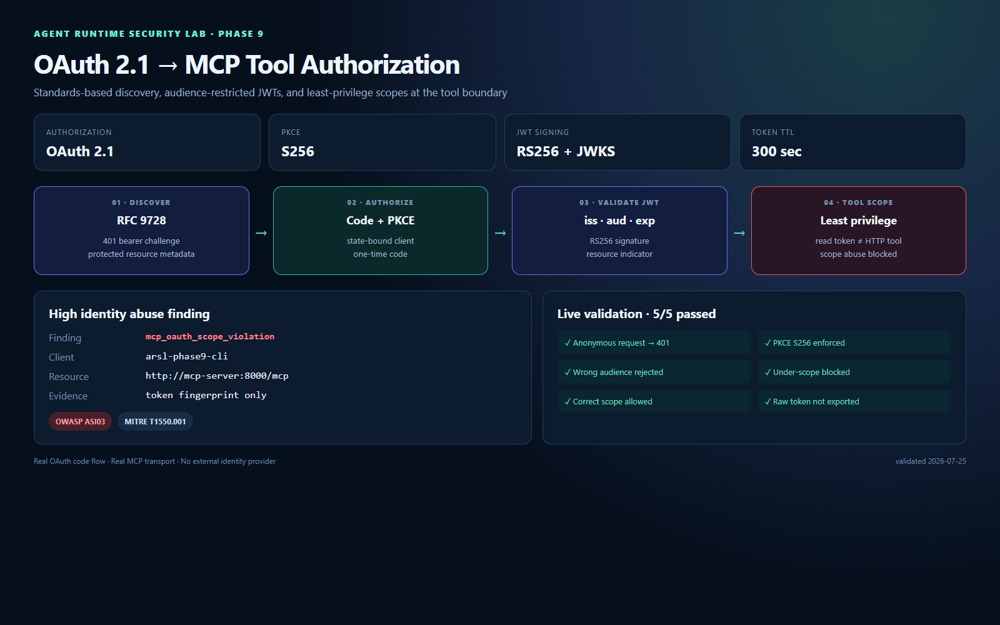
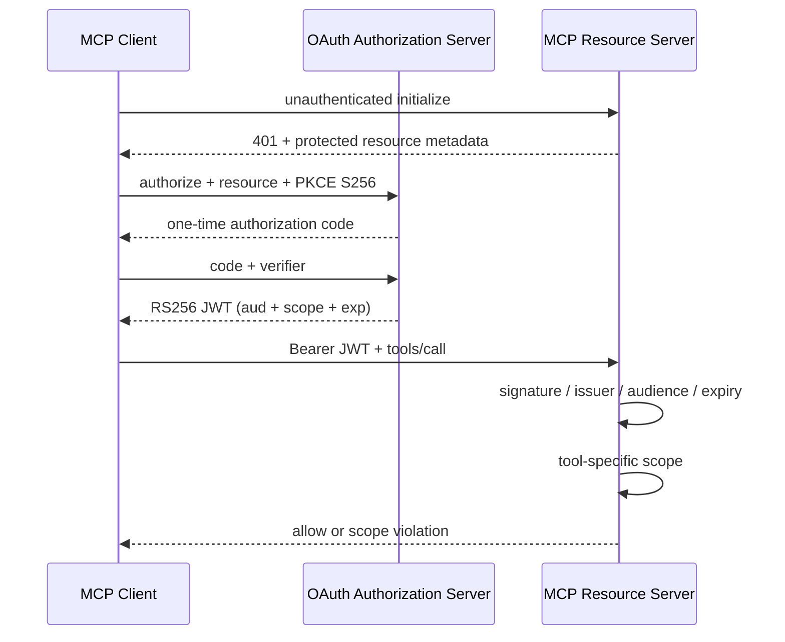

# Phase 9 — OAuth 2.1 MCP Authorization & Tool Scope

## 한 줄 요약

MCP 서버를 OAuth 2.1 Protected Resource로 전환하고, PKCE `S256`, audience 제한 JWT, 도구별 scope를 실제 Docker 환경에서 검증했다.



## 왜 이 단계가 필요한가

정책 엔진이 도구 호출을 허용해도 MCP transport 자체가 익명 접근을 받거나 하나의 광범위한 토큰을 모든 도구에 사용하면 identity 경계가 무너진다. Phase 9는 다음 질문에 답한다.

- 인증되지 않은 클라이언트가 MCP session을 시작할 수 있는가?
- 다른 resource용 access token이 MCP 서버에서 수락되는가?
- 문서 읽기 token으로 HTTP 도구를 호출할 수 있는가?
- authorization code를 탈취해도 PKCE verifier 없이 교환할 수 있는가?
- 검증 증거에 bearer token 원문이 남는가?

## 아키텍처



## 구현 포인트

### 1. MCP 표준 discovery

- Authorization Server Metadata 제공
- MCP Python SDK의 RFC 9728 Protected Resource Metadata 사용
- `401 Unauthorized`에서 bearer challenge 제공
- authorization server와 resource server 역할 분리

### 2. OAuth 2.1 보안 경계

- Authorization Code + PKCE `S256`
- state 값 round-trip 검증
- authorization code 60초 만료 및 단일 사용
- RS256 서명과 JWKS 공개
- `iss`, `sub`, `aud`, `exp`, `iat`, `client_id`, `scope`, `jti` 필수 검증
- RFC 8707 `resource` 값으로 MCP audience 고정

### 3. 도구별 least privilege scope

| MCP tool | Required scope |
|---|---|
| `read_document` | `mcp:read_document` |
| `mock_http_request` | `mcp:mock_http_request` |
| `run_command` | `mcp:run_command` |

공통 `mcp:access` scope를 통과한 뒤 각 도구가 추가 scope를 확인한다. Agent Gateway는 호출할 도구에 필요한 scope만 요청하고 access token을 짧게 캐시한다.

### 4. 위협 매핑

scope가 부족한 application access token의 도구 호출을 `mcp_oauth_scope_violation` finding으로 분류한다.

- OWASP Agentic `ASI03` — Identity & Privilege Abuse
- MITRE ATT&CK `T1550.001` — Application Access Token
- Severity: High

## 실제 검증 시나리오

```powershell
powershell -NoProfile -ExecutionPolicy Bypass -File .\scripts\run-lab.ps1
powershell -NoProfile -ExecutionPolicy Bypass -File .\scripts\verify-oauth.ps1
```

| Check | Expected | Result |
|---|---|---|
| MCP initialize without token | HTTP 401 | PASS |
| Authorization server metadata | PKCE S256 | PASS |
| Token request for wrong resource | HTTP 400 | PASS |
| Read-only token calls HTTP tool | scope error | PASS |
| Read-only token calls document tool | execution | PASS |
| Evidence exports raw bearer token | false | PASS |

정적 결과는 [Phase 9 evidence](evidence/phase9-mcp-oauth.json)에 저장했다. access token은 저장하지 않고 SHA-256 fingerprint 16자만 남긴다.

## 테스트 결과

- Agent API: 30 tests
- MCP Server: 6 tests
- OAuth Authorization Server: 4 tests
- sensor adapter: 8 tests
- detection runner: 3 tests
- Kubernetes attack-chain: 4 tests
- OPA: 5/5 policies
- Docker Compose 전체 정책·승인·runtime 회귀 검증 통과

## 차별성

일반적인 MCP OAuth 예제는 로그인 성공 여부만 보여준다. 이 프로젝트는 인증과 authorization을 runtime security pipeline에 연결한다.

1. 표준 discovery와 PKCE 흐름을 실제로 실행한다.
2. JWT signature뿐 아니라 resource audience와 도구별 scope를 함께 검증한다.
3. scope abuse를 OWASP Agentic과 MITRE ATT&CK finding으로 변환한다.
4. token 원문을 증거에서 제외하면서 재현 가능한 fingerprint만 남긴다.
5. 기존 OPA, human approval, eBPF, Kubernetes audit, OCSF 계층과 동시에 회귀 검증한다.

## 안전 범위

- 모든 서비스는 전용 Docker network에서 실행
- OAuth 관리 포트는 `127.0.0.1:19000`에만 노출
- 테스트 Authorization Server의 승인은 자동화된 로컬 lab 전용
- client secret은 실행 시 난수로 생성하며 Git에 저장하지 않음
- signing key는 container 시작 시 메모리에서 생성
- access token 원문과 authorization code는 정적 evidence에서 제외
- 외부 identity provider나 인터넷 resource에 접근하지 않음

## 운영 환경으로 확장할 때

- 테스트 Authorization Server 대신 조직 IdP 사용
- TLS와 public issuer URL 적용
- signing key를 KMS/HSM에서 관리하고 rotation 수행
- DPoP 또는 mTLS sender-constrained token 적용
- consent, refresh token rotation, revocation, audit retention 추가
- scope violation을 SIEM alert와 incident response workflow로 연결

## 참고 자료

- [MCP Authorization Specification](https://modelcontextprotocol.io/specification/2025-11-25/basic/authorization)
- [RFC 9728 — OAuth 2.0 Protected Resource Metadata](https://www.rfc-editor.org/rfc/rfc9728.html)
- [RFC 8707 — Resource Indicators for OAuth 2.0](https://www.rfc-editor.org/rfc/rfc8707.html)
- [OAuth 2.1 Internet-Draft](https://datatracker.ietf.org/doc/draft-ietf-oauth-v2-1/)
- [MITRE ATT&CK T1550.001](https://attack.mitre.org/techniques/T1550/001/)
